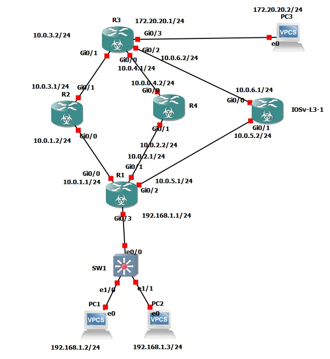
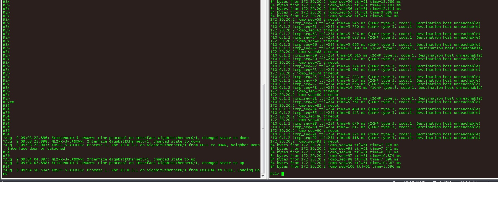

# Развертывание отказоустойчивого выхода в интернет Multi-homed с выделением конкретного ISP на свою подсетку.

###  Задание:
1. Построить сеть и произвести базовые настройки оборудования
2. Настроить OSPF на R2 - R5
3. Сконфигурировать на R1 access-list IP2, IP3, которые отбирают (permit) трафик конкретных хостов (подсетей), для использования в PBR ISP
4. Настроить PBR ISP из двух блоков, для переназначения трафика левой части через правый ISP3(R5), правой части - через левый ISP1(R2)
3. Настроить дефолтный маршрут через ISP 2
4. Сконфигурировать PAT overload на R1, чтобы для каждой ветки inside ip брался свой IF outside


###  Решение:
Графическая схема, с нанесенной информацией о интерфейсах.


### Ответы на вопросы Л/р:
- Произведена настройка адресов сетевой инфраструктуры в соответствии с графической схемой
- Включен OSPF на R2-R5
- Сконфигурированы access-lists IP2, IP3
```
ip access-list extended IP2
 permit ip host 192.168.1.2 any
ip access-list extended IP3
 permit ip host 192.168.1.3 any
 ```
- Сконфигурирован PBR ISP, который задает левой ветки выход через правого провайдера (IP2-ISP3), правой ветке через левого провайдера (IP3-ISP1)
```
route-map ISP permit 10
 match ip address IP2
 set ip next-hop 10.0.5.2
!
route-map ISP permit 20
 match ip address IP3
 set ip next-hop 10.0.1.2
 ```

- Настроен дефолтный маршрут через ISP 2
```
ip route 0.0.0.0 0.0.0.0 10.0.2.2
```
- Сконфигурировать PAT overload на R1, с привязкой к исходящему трафику
```
route-map ISP1 permit 10
 match ip address IP3
 match interface GigabitEthernet0/0
ip nat inside source route-map ISP1 interface GigabitEthernet0/0 overload
!
route-map ISP3 permit 10
 match ip address IP2
 match interface GigabitEthernet0/2
ip nat inside source route-map ISP3 interface GigabitEthernet0/2 overload
```
Конечные настройки route-map
```
R1#sho ip policy
Interface      Route map
Gi0/3          ISP
R1#sho route-map
route-map ISP, permit, sequence 10
  Match clauses:
    ip address (access-lists): IP2 
  Set clauses:
    ip next-hop 10.0.5.2
Nexthop tracking current: 0.0.0.0
10.0.5.2, fib_nh:0,oce:0,status:0
  Policy routing matches: 152 packets, 15352 bytes

route-map ISP, permit, sequence 20
  Match clauses:
    ip address (access-lists): IP3 
  Set clauses:
    ip next-hop 10.0.1.2
Nexthop tracking current: 0.0.0.0
10.0.1.2, fib_nh:0,oce:0,status:0
  Policy routing matches: 32 packets, 3392 bytes

route-map ISP2, permit, sequence 10
  Match clauses:
    interface GigabitEthernet0/1 
  Set clauses:
  Policy routing matches: 0 packets, 0 bytes
route-map ISP3, permit, sequence 10
  Match clauses:
    ip address (access-lists): IP2 
    interface GigabitEthernet0/2 
  Set clauses:
  Policy routing matches: 0 packets, 0 bytes
route-map ISP1, permit, sequence 10
  Match clauses:
    ip address (access-lists): IP3 
    interface GigabitEthernet0/0 
  Set clauses:
  Policy routing matches: 0 packets, 0 bytes
```

-Работа PAT проверена пингом до 172.20.20.2. Видно, что трафик идет разными путями, в соответствии с ТЗ
```
PC1> trace 172.20.20.2
trace to 172.20.20.2, 8 hops max, press Ctrl+C to stop
 1   192.168.1.1   6.742 ms  6.341 ms  4.099 ms
 2   10.0.5.2   9.738 ms  12.237 ms  9.858 ms
 3   10.0.6.2   11.205 ms  8.759 ms  7.976 ms
 4   *172.20.20.2   8.812 ms (ICMP type:3, code:3, Destination port unreachable)
 
PC2> trace 172.20.20.2
trace to 172.20.20.2, 8 hops max, press Ctrl+C to stop
 1   192.168.1.1   4.539 ms  5.131 ms  3.546 ms
 2   10.0.1.2   9.327 ms  6.668 ms  6.970 ms
 3   10.0.3.2   7.751 ms  8.647 ms  8.390 ms
 4   *172.20.20.2   11.365 ms (ICMP type:3, code:3, Destination port unreachable)

```


Конечные настройки оборудования представлены по ссылкам [R1](Configs/R1), [ISP1](Configs/R2), [ISP2](Configs/R4), [ISP3](Configs/R5), [R3](Configs/R3).

Конечный интерес для задачи представляет разработка ip sla, который переопределяет PBR таким образом, чтобы при падении какого-либо провайдера, трафик переключался ISP1-ISP3-ISP2 или ISP3-ISP1-ISP2, то есть ISP2 был бы задействован в последнюю очередь
Частичное решение задачи представлено ниже:
Добавляем 2 зонда ip SLA1,3. Они проверяют некий сторонний ресурс через ISP1, ISP3 соответственно:
Возможны 2 варианта зондов:
I
```
R1#show run | sec ip sla
track 1 ip sla 1
track 3 ip sla 3
ip sla 1
 icmp-jitter 10.0.3.2 source-ip 10.0.1.1
 frequency 5
ip sla schedule 1 life forever start-time now
ip sla 3
 icmp-jitter 10.0.6.2 source-ip 10.0.5.1
 frequency 5
ip sla schedule 3 life forever start-time now
```
II - менее предпочтительный, который срабатывает на любое падение канала
```
ip sla 1
 icmp-echo 10.0.3.2 source-interface GigabitEthernet0/0
 frequency 10
ip sla schedule 1 life forever start-time now
ip sla 3
 icmp-echo 10.0.6.2 source-interface GigabitEthernet0/2
 frequency 10
ip sla schedule 3 life forever start-time now

track 1 ip sla 1
!
track 3 ip sla 3
```
Корректируем Route-map ISP путем добавления вторичного next-hop. Этим мы добиваемся чтобы RM подставлял строчку "выжившего" ISP и направлял интересующий трафик через соответствующего ISP.
```
route-map ISP permit 10
 match ip address IP2
 set ip next-hop verify-availability 10.0.5.2 10 track 3
 set ip next-hop verify-availability 10.0.1.2 20 track 1
 set ip next-hop 10.0.2.2
route-map ISP permit 20
 match ip address IP3
 set ip next-hop verify-availability 10.0.1.2 10 track 1
 set ip next-hop verify-availability 10.0.5.2 20 track 3
 set ip next-hop 10.0.2.2
```
Для каждого RM, определяющего работу PAT, добавляем вторичный RM 20, с проверкой прохождения трафика через второй IF. 
```
route-map ISP1 permit 10
 match ip address IP3
 match interface GigabitEthernet0/0
route-map ISP1 permit 20
 match ip address IP2
 match interface GigabitEthernet0/0

route-map ISP3 permit 10
 match ip address IP2
 match interface GigabitEthernet0/2
route-map ISP3 permit 20
 match ip address IP3
 match interface GigabitEthernet0/2
```
В случае падения ISP1, ISP3 - в дело будет вступать ISP2: здесь уже не будет никаких проверок на IP, его задача - выпустить любой трафик через ISP2 
```
route-map ISP2 permit 10
 match interface GigabitEthernet0/1

ip nat inside source route-map ISP2 interface GigabitEthernet0/1 overload
```
Проверка командой "show route-map", которая покажет какой маршрут подставляется в настоящее время, на основании состояния трекинга. Представлен вывод, в случае падения ISP1, ISP3.
```
show route-map
route-map ISP, permit, sequence 10
  Match clauses:
    ip address (access-lists): IP2 
  Set clauses:
    ip next-hop verify-availability 10.0.5.2 10 track 3  [down]
    ip next-hop verify-availability 10.0.1.2 20 track 1  [down]
    ip next-hop 10.0.2.2
  Policy routing matches: 39 packets, 4014 bytes
route-map ISP, permit, sequence 20
  Match clauses:
    ip address (access-lists): IP3 
  Set clauses:
    ip next-hop verify-availability 10.0.1.2 10 track 1  [down]
    ip next-hop verify-availability 10.0.5.2 20 track 3  [down]
    ip next-hop 10.0.2.2
  Policy routing matches: 48 packets, 4896 bytes
route-map ISP2, permit, sequence 10
  Match clauses:
    interface GigabitEthernet0/1 
  Set clauses:
  Policy routing matches: 0 packets, 0 bytes
route-map ISP3, permit, sequence 10
  Match clauses:
    ip address (access-lists): IP2 
    interface GigabitEthernet0/2 
  Set clauses:
  Policy routing matches: 0 packets, 0 bytes
route-map ISP3, permit, sequence 20
  Match clauses:
    ip address (access-lists): IP3 
    interface GigabitEthernet0/2 
  Set clauses:
  Policy routing matches: 0 packets, 0 bytes
route-map ISP1, permit, sequence 10
  Match clauses:
    ip address (access-lists): IP3 
    interface GigabitEthernet0/0 
  Set clauses:
  Policy routing matches: 0 packets, 0 bytes
route-map ISP1, permit, sequence 20
  Match clauses:
    ip address (access-lists): IP2 
    interface GigabitEthernet0/0 
  Set clauses:
  Policy routing matches: 0 packets, 0 bytes
```
Вывод маршрута при падении ISP1, ISP3:
```
PC1> trace 172.20.20.2
trace to 172.20.20.2, 8 hops max, press Ctrl+C to stop
 1   192.168.1.1   3.312 ms  2.135 ms  2.517 ms
 2   10.0.2.2   6.955 ms  3.327 ms  3.300 ms
 3   10.0.4.1   6.412 ms  4.892 ms  4.997 ms
 4     *  *  *
 5   172.20.20.2   8.662 ms  1.362 ms

PC2> trace 172.20.20.2
trace to 172.20.20.2, 8 hops max, press Ctrl+C to stop
 1   192.168.1.1   3.901 ms  1.848 ms  1.715 ms
 2   10.0.2.2   6.992 ms  3.288 ms  4.438 ms
 3   10.0.4.1   6.776 ms  5.065 ms  6.070 ms
 4   *172.20.20.2   8.006 ms (ICMP type:3, code:3, Destination port unreachable)
```

Были мысли дополнить конфигурацию сбросом текущих сессий трансляции, но посоветовавшись с Алексеем - решено не делать этого, так как NAT сам сбрасывает сессии через определнное время.
Единственное что смущает - достаточно большое число пропавших пакетов при восстановлении ISP1, ISP3. Пока нашел объяснение только в одном:
при отключении и последующем включении IF - происходит перестроение OSPF R2-R5

