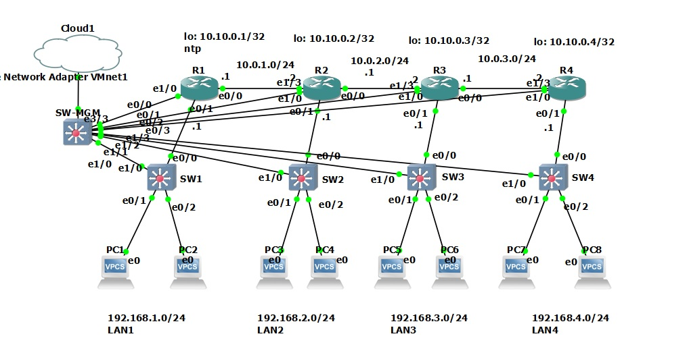

# Базовая настройка EIGRP на 2 узла



### Задание: 
1. Произвести базовую R1, R2 настройку в соответствии с изображением
2. Настроить EIGRP 
3. Проверить доступность подсетей


### 1. Базовая настройка [R1](cfg/R1), [R2](cfg/R2), [R3](cfg/R3), [R4](cfg/R4), [SW1](cfg/SW1), [SW2](cfg/SW2), [SW3](cfg/SW3), [SW4](cfg/SW4), 

произведена настройка ip-адресов на IF оборудования
### 2. Настроен протокол EIGRP на R1 - R4, пример отображен ниже

```
router eigrp 1
 network 10.0.1.0 0.0.0.255
 network 10.10.0.1 0.0.0.0
 network 192.168.1.0
 eigrp router-id 1.1.1.1
```
результатом настройки стали таблицы маршрутизации, отражающие как connected сети, так и сети полученные от протокола динамической маршрутизации eigrp, обозначенные буквой D:

```
R3(config-router)#do show ip route
...

Gateway of last resort is not set

      10.0.0.0/8 is variably subnetted, 7 subnets, 2 masks
D        10.0.1.0/24 [90/307200] via 10.0.2.1, 00:11:29, Ethernet1/3
C        10.0.2.0/24 is directly connected, Ethernet1/3
L        10.0.2.2/32 is directly connected, Ethernet1/3
C        10.0.3.0/24 is directly connected, Ethernet0/0
L        10.0.3.1/32 is directly connected, Ethernet0/0
D        10.10.0.1/32 [90/435200] via 10.0.2.1, 00:11:29, Ethernet1/3
C        10.10.0.3/32 is directly connected, Loopback0
D     192.168.1.0/24 [90/332800] via 10.0.2.1, 00:11:29, Ethernet1/3
D     192.168.2.0/24 [90/307200] via 10.0.2.1, 00:11:29, Ethernet1/3
      192.168.3.0/24 is variably subnetted, 2 subnets, 2 masks
C        192.168.3.0/24 is directly connected, Ethernet0/1.3
L        192.168.3.1/32 is directly connected, Ethernet0/1.3
D     192.168.4.0/24 [90/307200] via 10.0.3.2, 00:10:08, Ethernet0/0
      192.168.48.0/24 is variably subnetted, 2 subnets, 2 masks
C        192.168.48.0/24 is directly connected, Ethernet1/0.10
L        192.168.48.193/32 is directly connected, Ethernet1/0.10


R3(config-router)#do show ip route eigrp
...

Gateway of last resort is not set

      10.0.0.0/8 is variably subnetted, 7 subnets, 2 masks
D        10.0.1.0/24 [90/307200] via 10.0.2.1, 00:11:39, Ethernet1/3
D        10.10.0.1/32 [90/435200] via 10.0.2.1, 00:11:39, Ethernet1/3
D     192.168.1.0/24 [90/332800] via 10.0.2.1, 00:11:39, Ethernet1/3
D     192.168.2.0/24 [90/307200] via 10.0.2.1, 00:11:39, Ethernet1/3
D     192.168.4.0/24 [90/307200] via 10.0.3.2, 00:10:18, Ethernet0/0
```


### 3. Доступность подсетей проверялась командой ping на PC1:

```
PC1> ping 192.168.4.12
192.168.4.12 icmp_seq=1 timeout
192.168.4.12 icmp_seq=2 timeout
84 bytes from 192.168.4.12 icmp_seq=3 ttl=60 time=1.616 ms
84 bytes from 192.168.4.12 icmp_seq=4 ttl=60 time=1.565 ms
84 bytes from 192.168.4.12 icmp_seq=5 ttl=60 time=1.406 ms

PC1> ping 192.168.3.12
192.168.3.12 icmp_seq=1 timeout
192.168.3.12 icmp_seq=2 timeout
84 bytes from 192.168.3.12 icmp_seq=3 ttl=61 time=1.356 ms
84 bytes from 192.168.3.12 icmp_seq=4 ttl=61 time=1.168 ms
84 bytes from 192.168.3.12 icmp_seq=5 ttl=61 time=1.611 ms

PC1> ping 192.168.2.12
192.168.2.12 icmp_seq=1 timeout
192.168.2.12 icmp_seq=2 timeout
84 bytes from 192.168.2.12 icmp_seq=3 ttl=62 time=1.463 ms
84 bytes from 192.168.2.12 icmp_seq=4 ttl=62 time=1.070 ms
84 bytes from 192.168.2.12 icmp_seq=5 ttl=62 time=1.171 ms

PC1> trace 192.168.4.12
trace to 192.168.4.12, 8 hops max, press Ctrl+C to stop
 1   192.168.1.1   0.845 ms  0.649 ms  0.561 ms
 2   10.0.1.2   1.059 ms  0.950 ms  0.834 ms
 3   10.0.2.2   1.484 ms  0.954 ms  0.799 ms
 4   10.0.3.2   1.115 ms  2.214 ms  1.081 ms
 5     *  *  *
 6   *192.168.4.12   2.110 ms (ICMP type:3, code:3, Destination port unreachable) 
```
Командой trace проверился маршрут до PC1 - PC8


