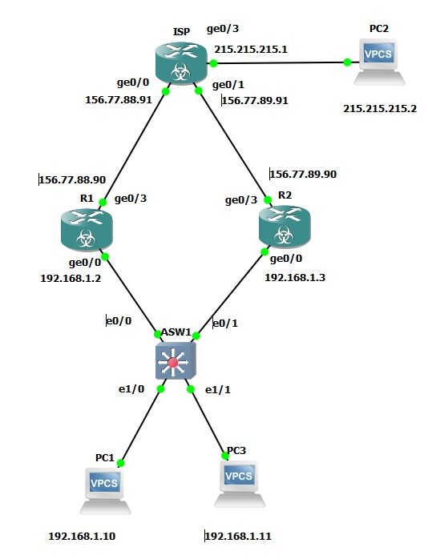

# Развертывание отказоустойчивого выхода в интернет

###  Задание:
1. Построить сеть и произвести базовые настройки оборудования
2. Сконфигурировать HSRP (standby1) на R1 и R2. Сделать R1 priority 110, проверить работу HSRP
3. Сконфигурировать PAT overload на R1, R2
4. Сконфигурировать ip sla на R1 и R2, чтобы приоритет HSRP снижался на 20 при падении доступности узла 8.8.8.8

###  Решение:
Графическая схема, с нанесенной информацией о интерфейсах.


### Ответы на вопросы Л/р:
- Произведена настройка адресов сетевой инфраструктуры в соответствии с графической схемой
- Выполнена настройка HSRP stdb1 на R1 (prior 110), R2
- Выполнена настройка NAT
- Конфиги устройств: [ASW1](ASW1), [ISP](ISP), [R1](R1), [R2](R2)

```
EdgeR1#sho ip nat tran
Pro Inside global      Inside local       Outside local      Outside global
icmp 156.77.88.90:45251 192.168.1.10:45251 215.215.215.1:45251 215.215.215.1:45251
icmp 156.77.88.90:45507 192.168.1.10:45507 215.215.215.1:45507 215.215.215.1:45507
icmp 156.77.88.90:45763 192.168.1.10:45763 215.215.215.1:45763 215.215.215.1:45763
icmp 156.77.88.90:1193 192.168.1.10:46019 215.215.215.1:46019 215.215.215.1:1193
icmp 156.77.88.90:46275 192.168.1.10:46275 215.215.215.1:46275 215.215.215.1:46275
icmp 156.77.88.90:1194 192.168.1.10:46531 215.215.215.1:46531 215.215.215.1:1194
icmp 156.77.88.90:46787 192.168.1.10:46787 215.215.215.1:46787 215.215.215.1:46787
icmp 156.77.88.90:46019 192.168.1.11:46019 215.215.215.2:46019 215.215.215.2:46019
icmp 156.77.88.90:46531 192.168.1.11:46531 215.215.215.2:46531 215.215.215.2:46531
```

- Выполнена настройка ip sla на R1 (prior -20), R2 (prior -20). Priority отрабатывает при падении IF
```
EdgeR1#show standby 
GigabitEthernet0/0 - Group 1
  State is Standby
    17 state changes, last state change 00:00:25
  Virtual IP address is 192.168.1.1
  Active virtual MAC address is 0000.0c07.ac01
    Local virtual MAC address is 0000.0c07.ac01 (v1 default)
  Hello time 1 sec, hold time 3 sec
    Next hello sent in 0.448 secs
  Authentication MD5, key-string
  Preemption enabled
  Active router is 192.168.1.3, priority 100 (expires in 2.784 sec)
  Standby router is local
  Priority 90 (configured 110)
    Track object 1 state Down decrement 20
  Group name is "hsrp-Gi0/0-1" (default)
  
EdgeR1#
*Jul 28 06:21:05.374: %LINEPROTO-5-UPDOWN: Line protocol on Interface GigabitEthernet0/3, changed state to down
*Jul 28 06:21:06.374: %LINK-3-UPDOWN: Interface GigabitEthernet0/3, changed state to down
*Jul 28 06:21:14.683: %TRACK-6-STATE: 1 ip sla 1 reachability Up -> Down
*Jul 28 06:21:14.704: %HSRP-5-STATECHANGE: GigabitEthernet0/0 Grp 1 state Active -> Speak
*Jul 28 06:21:18.118: %HSRP-5-STATECHANGE: GigabitEthernet0/0 Grp 1 state Speak -> Standby
```
Работа HSRP проверена на VM1, VM2: при отключении (suspend) линка до ISP - второй роутер становится Active и продолжает NAT
Работа инфраструктуры проверялась утилитой ping с VM1, VM2: все ip-адреса сетевой инфраструктуры доступны обоим ПК, после формирования ими ipv6-адресов.
