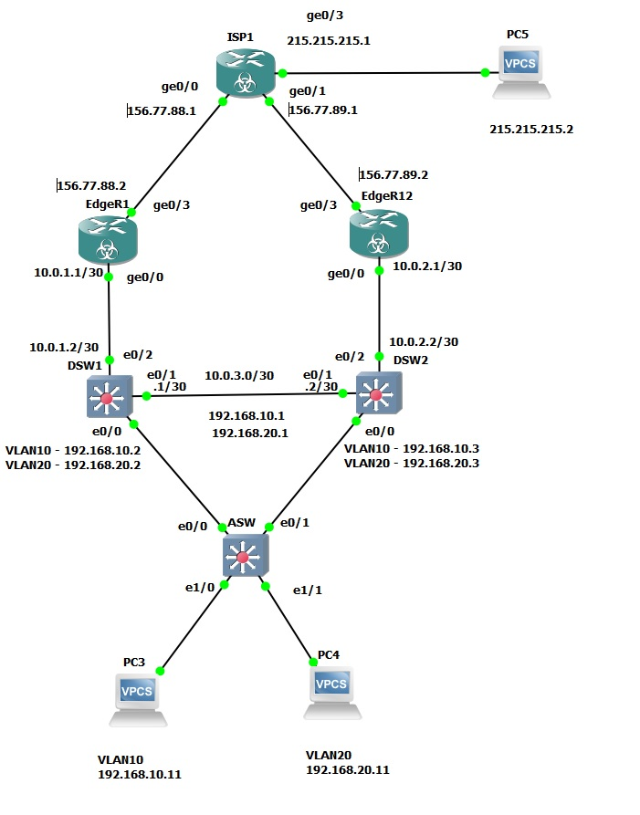

# Развертывание отказоустойчивого выхода в интернет

###  Задание:
1. Построить сеть и произвести базовые настройки оборудования
2. Сконфигурировать PAT overload на EdgeR1, EdgeR2 на подсети DATA, 10.0.1.0, 10.0.2.0, 10.0.3.0
3. Сконфигурировать HSRP (standby10, 20) на DSW1 и DSW2. Сделать DSW1 priority 110 за VLAN10, DSW2 priority 110 за VLAN20 проверить работу HSRP
4. Сконфигурировать ip sla на DSW1 и DSW2, чтобы приоритет соответствующего HSRP-standby снижался на 20 при падении доступности IF ISP-GW соответствующей ветки
5. Сконфигурировать ip sla на R1 и R2, чтобы приоритет HSRP снижался на 20 при падении доступности узла 8.8.8.8

###  Решение:
Графическая схема, с нанесенной информацией о интерфейсах.

### Ответы на вопросы Л/р:
- Произведена настройка адресов сетевой инфраструктуры в соответствии с графической схемой
- Выполнена настройка NAT на DATA и технологическую подсеть 10.0.0.0
- Выполнена настройка HSRP stdb10,20 на DSW1 (10 - prior110), HSRP stdb10,20 на DSW2 (20 - prior110)
- выполнена настройка ip sla на DSW1,2; каждая ветка мониторит ISP-GW своей стороны, при отсутствии пинга - снижает priority того HSRP, который отвечает за primary VLAN соответствующей стороны
- выполнена настройка spanning-tree  DSW1 - vlan10 (Root primary), DSW2 - vlan20 (Root primary)

- Выполнена настройка ip sla на R1 (prior -20), R2 (prior -20). Priority отрабатывает при падении IF

Работа HSRP проверена на VM1, VM2: при отключении (suspend) линка до ISP - второй роутер становится Active и продолжает NAT
Работа инфраструктуры проверялась утилитой ping с VM1, VM2: все ip-адреса сетевой инфраструктуры доступны обоим ПК, после формирования ими ipv6-адресов.

Конечные настройки оборудования представлены по ссылкам [ASW](config/ASW), [R1](config/R1), [S2](config/S2), [R2](config/R2).
