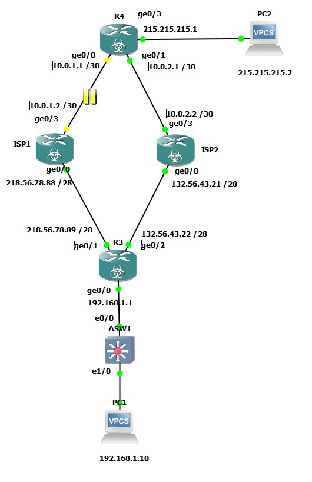

# Развертывание отказоустойчивого выхода в интернет Multi-homed. DM сказал что это самый сложный выход.

###  Задание:
1. Построить сеть и произвести базовые настройки оборудования
2. Сконфигурировать ip SLA, track1 на R3 так, чтобы он пинговал lo0 R4 (8.8.8.8) через gi0/1
3. Настроить дефолтный маршрут через ISP 1, который мониторится track 1 и гаснет в случае падения доступности 8.8.8.8 через ISP1 GW
4. Настроить дефолтный маршрут через ISP 2, через ISP2 GW, с метрикой 10
5. Сконфигурировать PAT overload на R3, подсети DATA, 10.0.1.0 через 2 route-map, чтобы PAT подставлял разные OUT ip, в зависимости от того, через какой IF идет трафик 

###  Решение:
Графическая схема, с нанесенной информацией о интерфейсах.




### Ответы на вопросы Л/р:
- Произведена настройка адресов сетевой инфраструктуры в соответствии с графической схемой
- Сконфигурирован ip SLA, track1 на R3 так, чтобы он пинговал lo0 R4 (8.8.8.8) через gi0/1
- Конфиги устройств: [ASW](configs/ASW), [ISP1](configs/ISP1), [ISP2](configs/ISP2), [R3](configs/R3), [R4](configs/R4)
```
ip sla 1
 icmp-echo 8.8.8.8 source-interface GigabitEthernet0/1
 frequency 5
ip sla schedule 1 life forever start-time now
track 1 ip sla 1 reachability
```
- Настроен дефолтный маршрут через ISP 1, который мониторится track 1 и гаснет в случае падения доступности 8.8.8.8 через ISP1 GW
```
ip route 0.0.0.0 0.0.0.0 GigabitEthernet0/1 track 1
ip route 8.8.8.8 255.255.255.255 218.56.78.88
```

- Настроен дефолтный маршрут через ISP 2, через ISP2 GW, с метрикой 10
```
ip route 0.0.0.0 0.0.0.0 GigabitEthernet0/2 10
```
- Сконфигурирован PAT overload на R3, подсети DATA, 10.0.1.0 через 2 route-map, чтобы PAT подставлял разные OUT ip, в зависимости от того, через какой IF идет трафик 
```
route-map ISP1 permit 10
 match interface GigabitEthernet0/1
ip nat inside source route-map ISP1 interface GigabitEthernet0/1 overload
!
route-map ISP2 permit 10
 match interface GigabitEthernet0/2
ip nat inside source route-map ISP2 interface GigabitEthernet0/2 overload
```

Работа PAT проверена на VM1: при отключении (suspend) линка до ISP1-R4 - track1 убирает старый дефолтный маршрут ина его место встает маршрут с большей метрикой продолжает NAT
```
R3(config)#do sho ip route
Gateway of last resort is 0.0.0.0 to network 0.0.0.0
S*    0.0.0.0/0 is directly connected, GigabitEthernet0/2

R3(config)#do sho ip sla summ
IPSLAs Latest Operation Summary
Codes: * active, ^ inactive, ~ pending

ID           Type        Destination       Stats       Return      Last
                                           (ms)        Code        Run 
-----------------------------------------------------------------------
*1           icmp-echo   8.8.8.8           -           Timeout     4 seconds ago

R3(config)#do sho track 1
Track 1
  IP SLA 1 reachability
  Reachability is Down
    11 changes, last change 00:34:03
  Latest operation return code: Timeout
  Tracked by:
    Static IP Routing 0
```


Конечные настройки оборудования представлены по ссылкам [ASW](Configs/ASW), [R3](Configs/R3), [ISP1](Configs/ISP1), [ISP2](Configs/ISP2), [R4](Configs/R4).
