# VPN - GRE[Generic Rooting Encapsulatio]

Шаблон ноды 7206 VXR с установленным модулем PA-8E

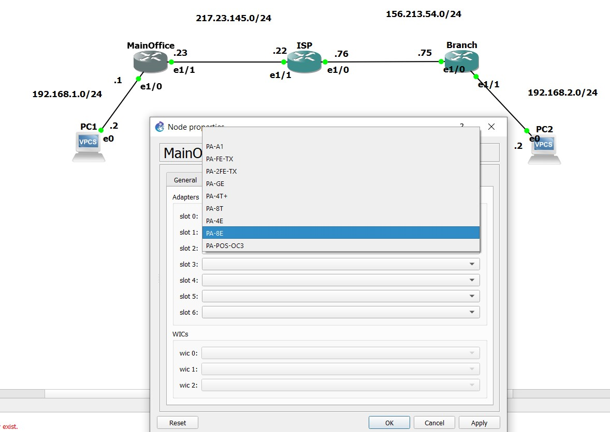

Команды
- отключение прерывание команд пользователя
```
line con 0
loggin sync
exec-timeout 0 0
no ip domain lookup
hostname
```

- Настройки IP в соответствии со схемой сети

VPN - позволяет объединять локальные сети между геограчфически распределенными площадками

## Настройка GRE:
### задаем настройки Tunnel GRE ip mode
   - MainOffice
      - создаем виртуальный интерфейс Tunnel0 
      - указываем режим работы интерфейса как туннельный GRE
      - указываем ip адрес для туннельного интерфейса (ip из частного диапазона, который запишем на страничку EXCEL-файла со списками используемых на предприятии подсетей).
      - указываем физический интерфейс смотрящий в интернет, через который будет выходить поток данных. 
      - указываем внешний (белый) ip адрес противоположного роутера, с которым мы хотим установить VPN GRE туннель
      ```
      int tunnel 0
      tunnel mode gre ip
      ip address 192.168.3.1 255.255.255.252
      tunnel so e1/1
      tunnel dest 156.213.54.75
      ```
   - Branch
      ```
      int tunnel 0
      tunnel mode gre ip
      ip add    192.168.3.2 255.255.255.252
      tunnel so e1/0
      tunnel dest 217.23.145.23
      ```
```
MainOffice(config-if)#do sho ip int br
...
Ethernet1/0                192.168.1.1     YES manual up                    up      
Ethernet1/1                217.23.145.23   YES manual up                    up      
...
Tunnel0                    192.168.3.1     YES manual up                    up      
```

настроим и ответную часть (после задания вые ip tunnel поднимается автоматически) и попробуем ping между роутерами

```
Branch(config)#do sho run | sec tun 
 tunnel source Ethernet1/0
 tunnel destination 217.23.145.23
```

```
Branch(config-if)#do ping 192.168.3.1
...
Sending 5, 100-byte ICMP Echos to 192.168.3.1, timeout is 2 seconds:
!!!!!
Success rate is 100 percent (5/5), round-trip min/avg/max = 12/26/32 ms
```

Wireshark показывает что произошел обмен, причем он с легкостью его развернул, значит обмен не был шифрованным


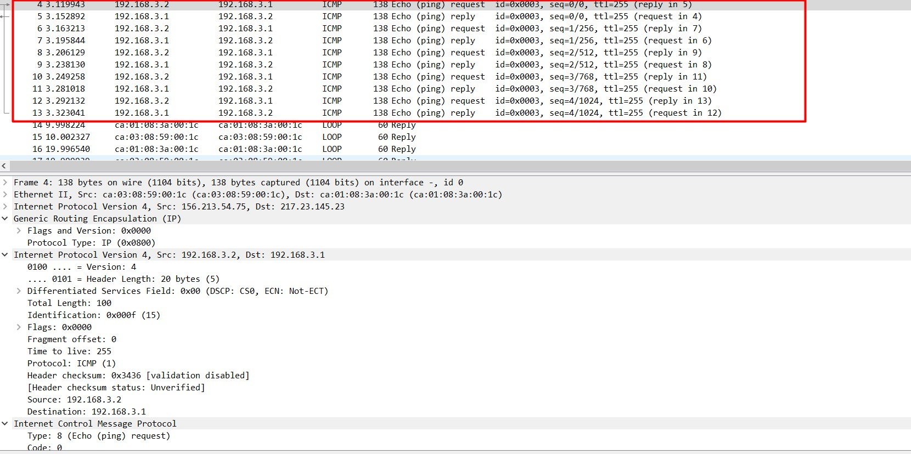

### Задаем маршрут через GRE tunnel 
MainOffice
```
ip route 192.168.2.0 255.255.255.0 tunnel 0
```
Branch
```
ip route 192.168.1.0 255.255.255.0 tunnel 10
```
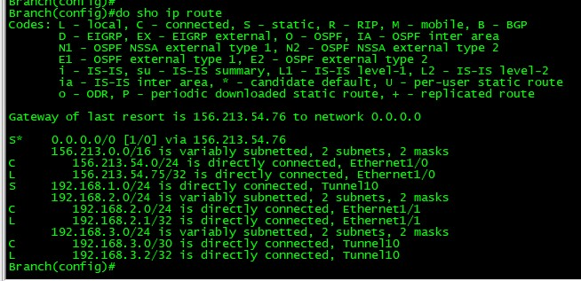

Пинг пошел, Wireshark опять все увидел

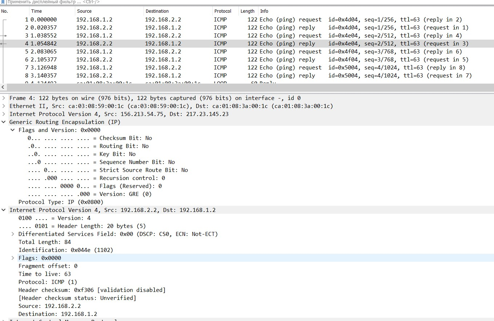

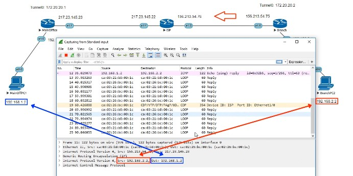

## Принцип работы GRE
Пакет от PC1 до PC2 (пассажио/зфшдщфв) преобразуется: дорисовывается новый заголовок
- GRE (gre header)
- новый IP (delivery header)
пассажиром может быть не только IP? но и IPS, AppleTalk, CLNP ...

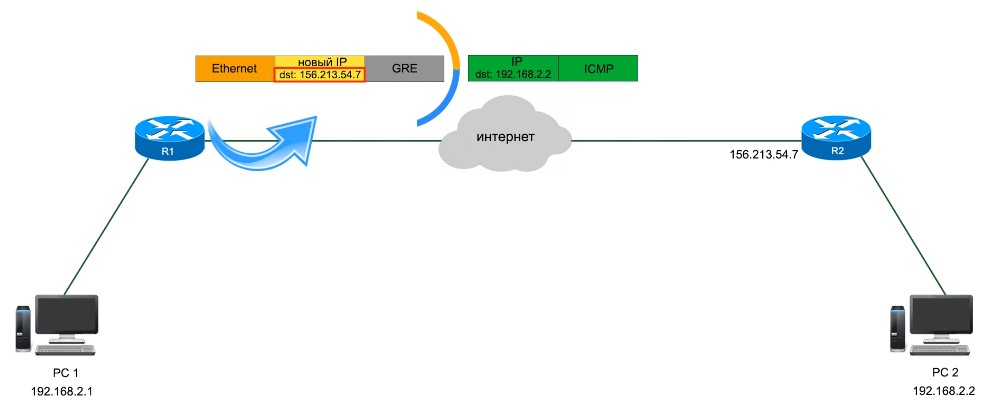

Wireshark нам показывает то же самое
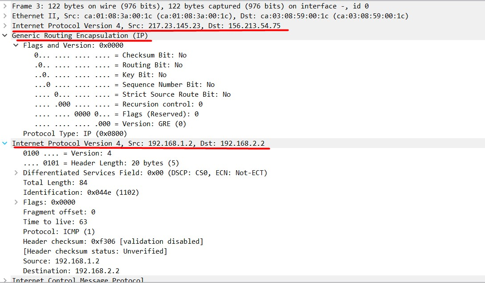

На R2 происходит обратная ситуация:
- удаляем белые IP
- удаляем GRE заголовок
- добавляем новые ethernet заголовок для передачи по новой канальной среде

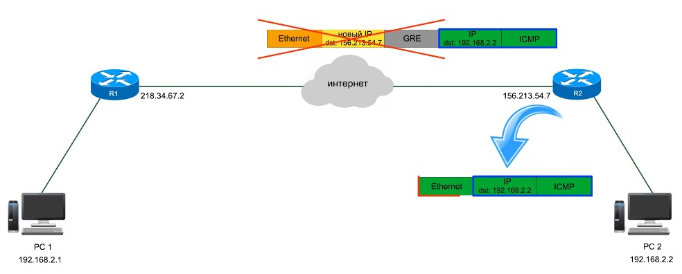

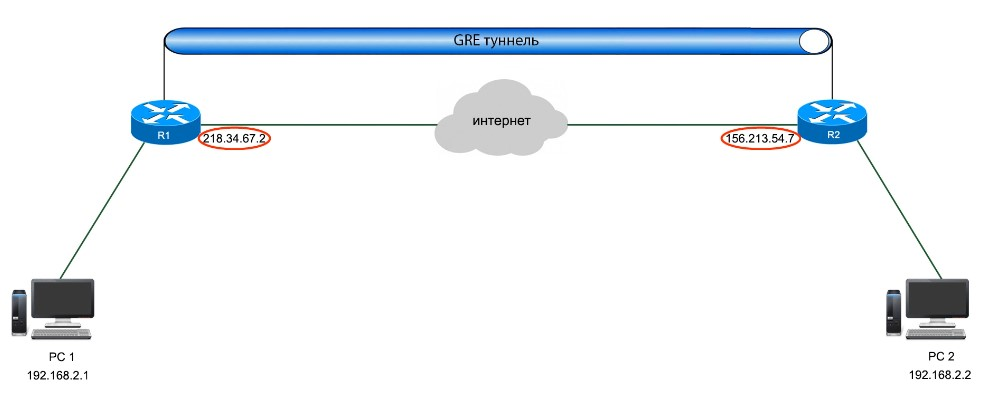

А вот так будет выглядеть trace через туннель
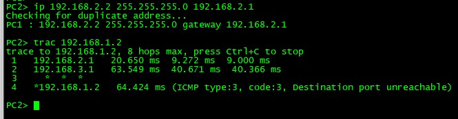

Проверка
покажет что туннель up, даже если противоположная сторона ляжет. Встроенная проверка работоспособности по-умолчанию не работает, ее надо включать.

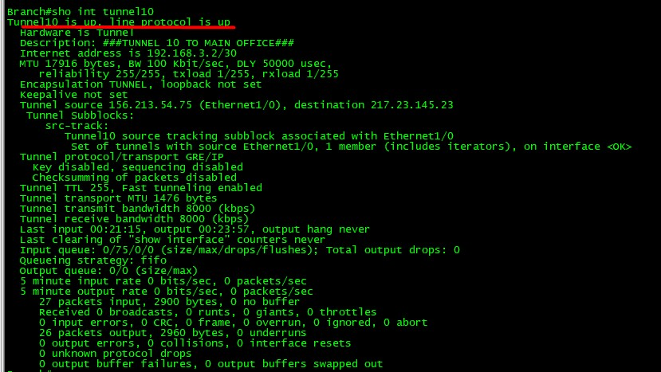

### Включение проверки работоспособности противоположной стороны
Делаем с обеих сторон, но я помню какие-то глюки при реализации в Ав...
Проверка работоспособности задается в секундах
```
int tunnel 0
keepalive <XX>
```

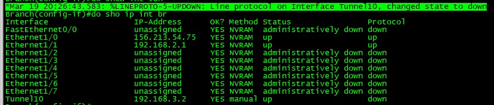

## Версии GRE
- 0 (наиболее частая, для прото IP, CLNP, IPX, AppleTalk)
- 1 (для протокол PPP - протокола канального уровня  ) 

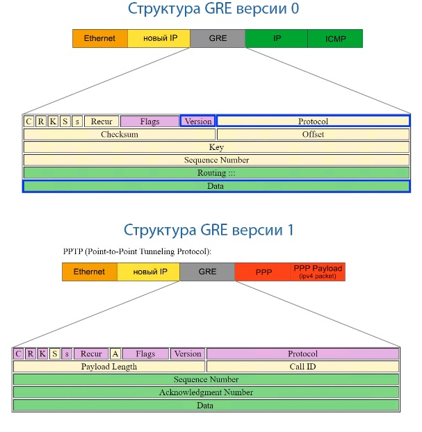

## Допнастройки GRE
### Tunnel key
некоторое подобие аутентификации. Видно, что туннель при включенном keepalive упадет, если с обратной стороны не задан аналогичный ```tunnel key```. В любом случае если на противоположной стороне нет ключа, то обмен пакетами между локалками  невозможен
```
MainOffice(config-if)#tunnel key 01
MainOffice(config-if)#do sho 
*Mar 19 20:39:00.491: %LINEPROTO-5-UPDOWN: Line protocol on Interface Tunnel0, changed state to down
```

Ключ передается в открытом виде и выяснитьключ не представляется сложным

## Добавим еще 1 бранч
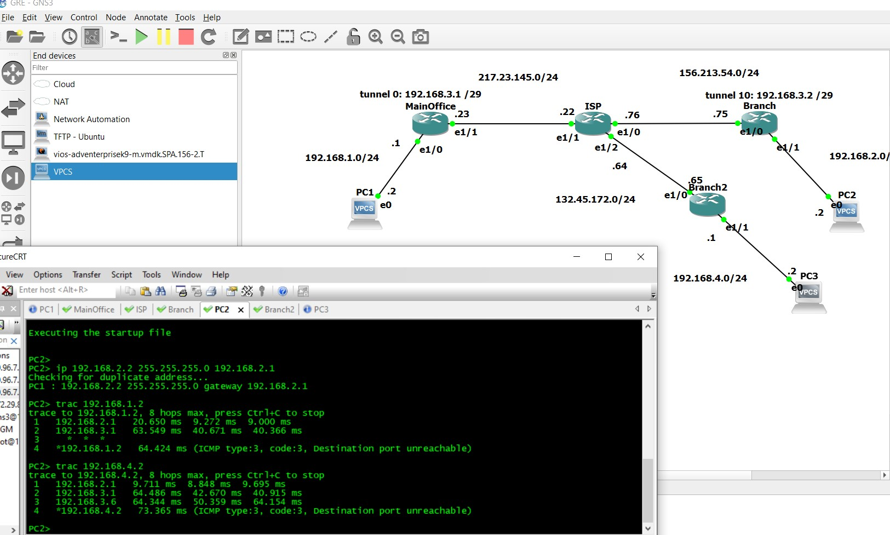

## Топологии VPN
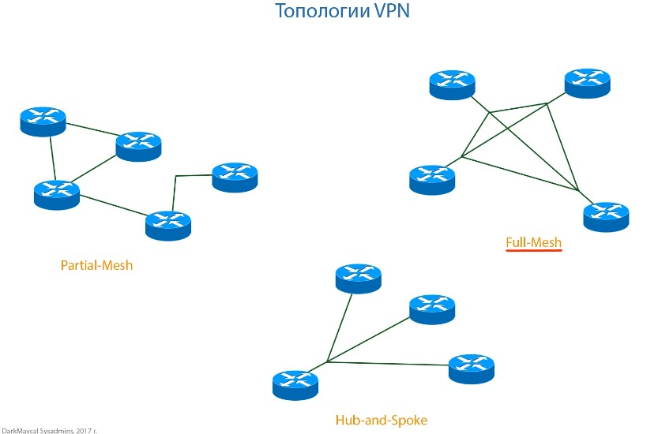
HUB-and-Spoke - звезда с центром в MainOffice. При большом количестве филиалов - траф идет через центр, поэтому требуется более дорогое оборудование. Кажущийся выход - ручной FullMesh, но эта топология имеет недостатки: куча VPN до всех филиалов. 

Перспективное направление -  DMVPN

